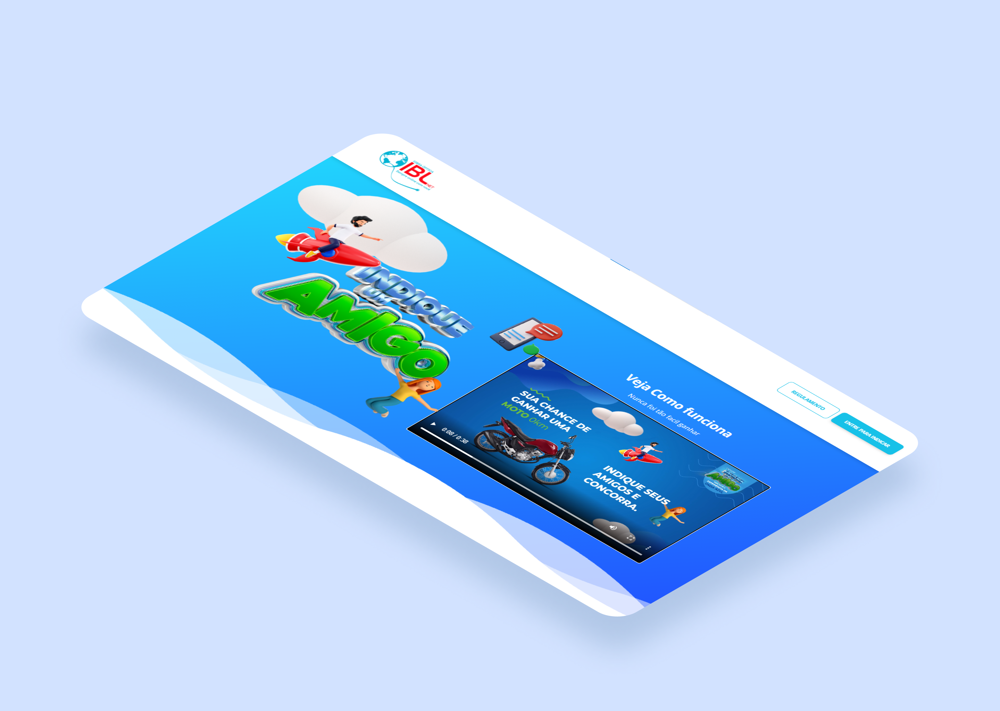

# [VPI Indique um amigo IBL](http://vpi.meuamigoibl.com.br/)

 

Quem nunca consumiu ou adquiriu algo que foi recomendado por alguém, seja um amigo ou familiar? Quem nunca recomendou algo que agradou para as pessoas pessoas próximas? Provavelmente todo mundo, não é mesmo?

Sim, provavelmente você já até utiliza essa estratégia, conhecida popularmente como boca a boca. Porém, você sabia que é possível organizar esse tipo de estratégia?

VIP (Vendas por Indicação) é simplesmente a forma de organização desse boca a boca, é um método que consiste em obter novas vendas por indicações feitas pelos seus clientes atuais. A ideia é que quanto mais os seus consumidores estiverem satisfeitos com os produtos ou serviços que você oferece, maior é a probabilidade de recomendarem a sua empresa para as pessoas que conhecem.

### Redes sociais

### IBL NET
Linkedin: <https://www.facebook.com/iblnet/>

Facebook: <https://www.facebook.com/CreativeTim?ref=sudpl-readme>

Instagram: <https://www.instagram.com/iblnet/>
