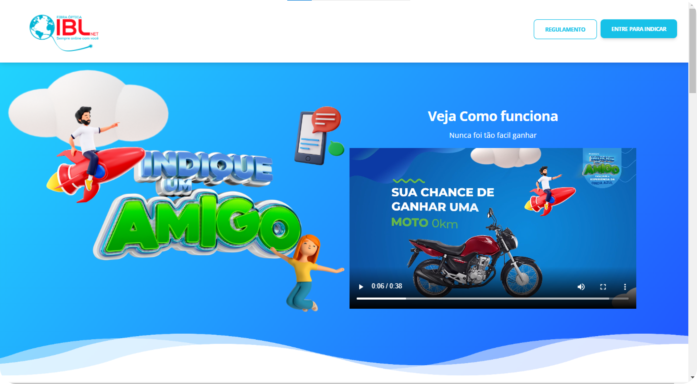
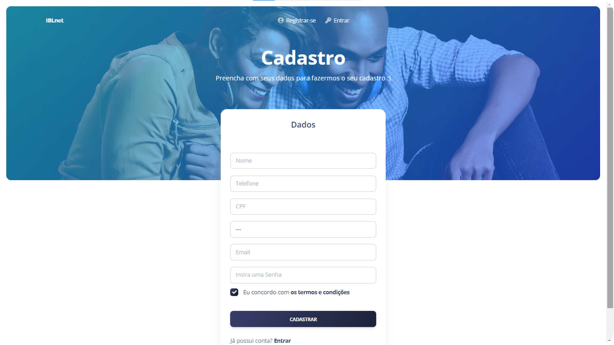
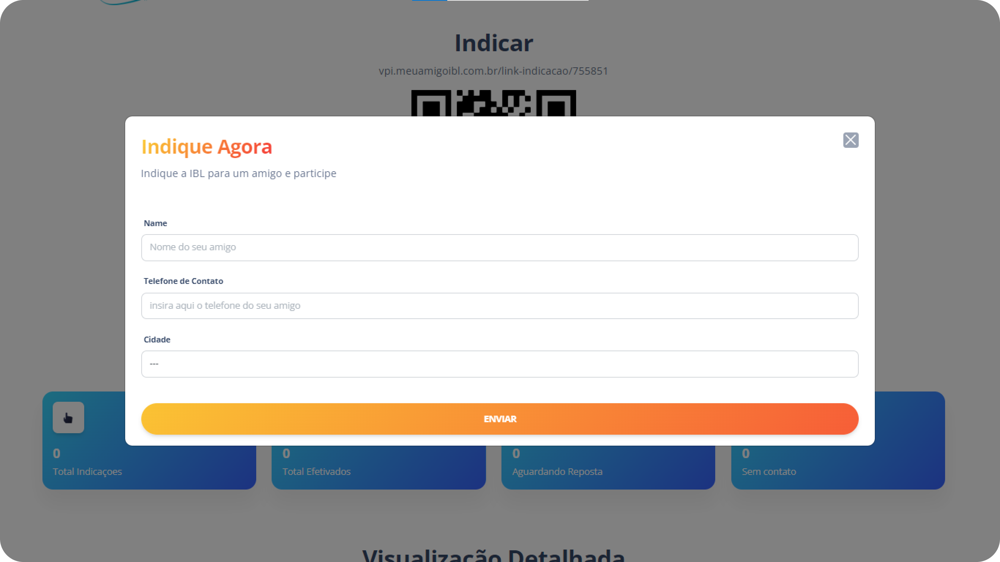

<h1 align="center"><a href="http://vpi.meuamigoibl.com.br/">VPI Indique um amigo IBL :globe_with_meridians::blue_heart::heart:</a></h1>

Quem nunca consumiu ou adquiriu algo que foi recomendado por alguém, seja um amigo ou familiar? Quem nunca recomendou algo que agradou para as pessoas pessoas próximas? Provavelmente todo mundo, não é mesmo?

Sim, provavelmente você já até utiliza essa estratégia, conhecida popularmente como boca a boca. Porém, você sabia que é possível organizar esse tipo de estratégia?

VIP (Vendas por Indicação) é simplesmente a forma de organização desse boca a boca, é um método que consiste em obter novas vendas por indicações feitas pelos seus clientes atuais. A ideia é que quanto mais os seus consumidores estiverem satisfeitos com os produtos ou serviços que você oferece, maior é a probabilidade de recomendarem a sua empresa para as pessoas que conhecem.

## Landing Page

Esta é a página inicial da campanha indique um amigo. Entrando nesta página, você encontrará primeiramente um pequeno vídeo que explica como vai ser a promoção. Abaixo do vídeo tem alguns cards indicando porque você deve indicar um amigo. Ainda nesta páginba, você vai encontrar as informações dos prêmios do sorteio e quais as dúvidas mais frequentes.

No header desta página você encontra 2 botões: **REGULAMENTO e ENTRE PARA INDICAR**.

 

Clicando em **REGULAMENTO**, você será redirecionado para uma página contendo todas as informações de como funcionará a campanha promocional.

Clicando em **ENTRE PARA INDICAR**, você será redirecionado para a página de login. Se ainda não tiver uma conta, você deverá criar uma nova clicando em REGISTRAR.

## Área do cliente
Após criar uma conta, você entrará na página de cliente (dashboard-user), mesmo que você seja um operador. Esta página é divida em 3 seções: **Indicar, Visualização Rápida e Visualização Detalhada**.

Em **Indicar**, você poderá: 
- Copiar um link de indicação clicando em COPIAR LINK DE INDICAÇÃO, copiando diretamente o link de será mostrado ou scanneando o QRcode.
- Indicar um amigo clicando em INDICAR AGORA. Após o clique, aparecerá um formulário para você preencher com o nome, o telefone e a cidade do seu amigo.
 

  
 

 
- Ver seus tickets clicando em MEUS TICKETS. Após o clique, aparecerá um painel contendo seus tickets.
 

  
 

Em **Visualização Rápida**, você poderá visualizar: 
- O total de indicações.
- O total de efetivados.
- A quantidade de respostas.
- A quantidade de contatos.

E em **Visualização Detalhada**, você encontrará as informações detalhadas de cada ticket.

## Área do operador

### Redes sociais

### IBL NET
Linkedin: <https://www.facebook.com/iblnet/>

Facebook: <https://www.facebook.com/CreativeTim?ref=sudpl-readme>

Instagram: <https://www.instagram.com/iblnet/>
